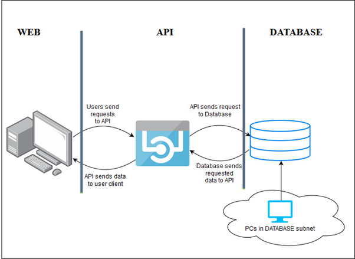

# Deploying Infrastructure as a code using Pulumi

Pulumi is an open source platform for building and deploying cloud infrastructure and applications in one of the four languages: JavaScript, python, typescript, Go. It supports multi cloud environment including support for Microsoft Azure, Google Cloud, Amazon Web Services and kubernetes. To learn more about pulumi, you can go through the [`documentation of Pulumi`](https://www.pulumi.com/docs/).

## Implementing 3 tier WEB-API-DATABASE architecture using Pulumi

WEB-API-DATABSE architecture is a three-tier architecture which is the basic model for developing a web database application and communication is done using this 3-level application logic.</br> 
At the base of the model lies the database tier where data gets stored in a database server and various CRUD operations are being performed here. Above the database tier lies the middle tier which contains the application logic and does all the communication between the user and the database. Lastly on the top lies the web tier which is the web client that is used to interact with the user. User puts their request through the web tier, which gets processed by the middle tier and accordingly operations are being performed on the data base tier.</br>

<p align="center">
</br>
Figure 1.1: Working of the Architecture 
</br></br>

Figure 1.2: Detailed Architecture in Azure
</p>

## How to Deploy:
-  Install Pulumi.
- [`Configure Azure`](https://www.pulumi.com/docs/reference/clouds/azure/setup/) so the Pulumi CLI can connect to Azure.
- Place this files in an empty directory and start pulumi in that directory.
- Type in the commands 
    ```
        pulumi init
        pulumi up
    ```